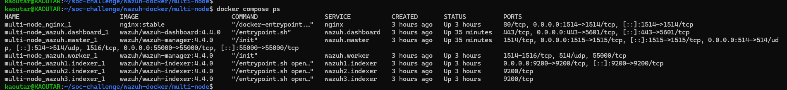
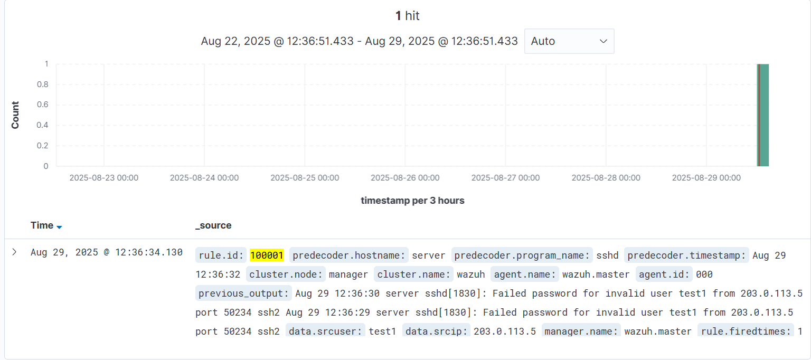
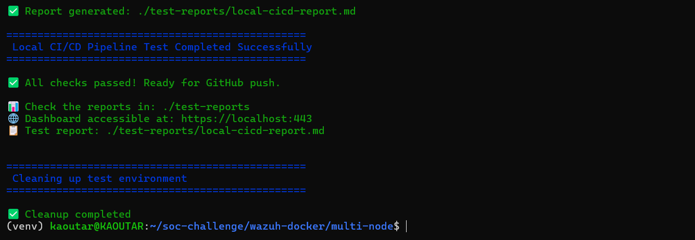
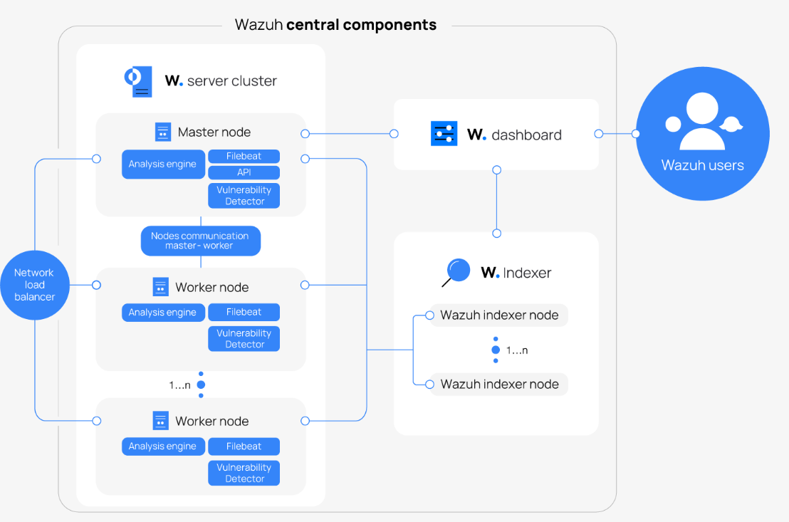

# Wazuh Multi-Node SOC Platform
Production-ready Security Operations Center with Wazuh multi-node cluster, automated CI/CD pipeline, custom threat detection, and comprehensive testing framework.






# What This Platform Delivers
In simple terms: A complete, enterprise-grade security monitoring solution with automated threat detection, multi-node clustering, and DevSecOps pipeline integration.
Key Capabilities:
- Multi-Node Wazuh Cluster - 3-node indexer cluster + manager/worker architecture
- Custom Threat Detection - SSH brute force detection with MITRE ATT&CK mapping
- Full CI/CD Pipeline - Automated testing, security scanning, and deployment
- Enterprise Security - TLS encryption, certificate management, and secrets handling
# Architecture Overview
## Architecture Overview


*Wazuh multi-node SOC platform showing distributed security operations architecture*

### Architecture Components

This diagram illustrates the core architecture of our production SOC platform and maps directly to our Docker Compose implementation:

**Wazuh Server Cluster:**
- **Master Node** → Our `wazuh.manager` container with API (port 55000), analysis engine, and rule processing
- **Worker Node** → Our `wazuh.worker` container providing distributed processing capacity
- **Node Communication** → Master-worker cluster synchronization for high availability

**Wazuh Indexer Cluster:**
- **Multi-node Setup** → Our 3-node OpenSearch cluster (`wazuh1.indexer`, `wazuh2.indexer`, `wazuh3.indexer`)
- **Ports 9200-9202** → Distributed data storage with automatic failover capability
- **Data Replication** → Configurable replica shards across nodes for data protection

**Wazuh Dashboard:**
- **Web Interface** → Our dashboard container (port 5601) for security monitoring and analysis
- **Direct Indexer Connection** → Queries the indexer cluster for real-time data visualization

**Network Infrastructure:**
- **Load Balancer** → Our Nginx reverse proxy (port 443) handling HTTPS termination
- **User Access** → External users connecting securely through TLS encryption

**Key Architectural Benefits:**
- **High Availability** - 3-node indexer cluster survives single node failure
- **Scalable Processing** - Manager/worker architecture distributes event processing load  
- **Secure Access** - All communications encrypted with mutual TLS authentication
- **Persistent Storage** - Docker volumes ensure data retention across container restarts

This architecture provides enterprise-grade security monitoring with automatic failover, distributed processing, and comprehensive threat detection capabilities.
# Quick Start
## Prerequisites
- Docker & Docker Compose (v20.10+ and v2.0+)
- Python 3.8+ with virtual environment support
- 8GB RAM minimum (16GB recommended for multi-node)
- Linux/macOS (Windows with WSL2)
## Step 1: Clone and Setup Environment
```bash
git clone https://github.com/kaoutarlahmaidi/soc-platform.git
cd soc-platform
# Create and activate Python virtual environment
python3 -m venv venv
source venv/bin/activate
# Install dependencies
pip install -r requirements.txt`
````
## Step 2: Deploy Infrastructure
```bash
cd ansible
ansible-playbook generate-indexer-certs.yml
```
## Step 3: Validate Deployment
```bash
# Run security scan
trivy image wazuh/wazuh-manager:4.4.0 --config trivy/trivy.yaml
trivy image wazuh/wazuh-dashboard:4.4.0 --config trivy/trivy.yaml
trivy image wazuh/wazuh-indexer:4.4.0 --config trivy/trivy.yaml
trivy image wazuh/nginx:4.4.0 --config trivy/trivy.yaml
# Test API health
python tests/api/test_api_health.py
# Test dashboard UI
python tests/selenium/test_wazuh_dashboard.py
```
#### Access Dashboard: https://localhost:443 (admin/SecretPassword)
# Future Work – Docker Swarm Migration
The current implementation is deployed with **Docker Compose** for rapid prototyping and testing.  
For production scalability and high availability, the repository also contains a `docker-stack.yml` file prepared for **Docker Swarm**.

#### For a complete technical walkthrough, including architecture details, deployment steps, and future migration plans, see the full project documentation:
https://github.com/kaoutarlahmaidi/soc-platform/blob/master/docs/Mini_SOC_Project_Report.pdf.pdf


